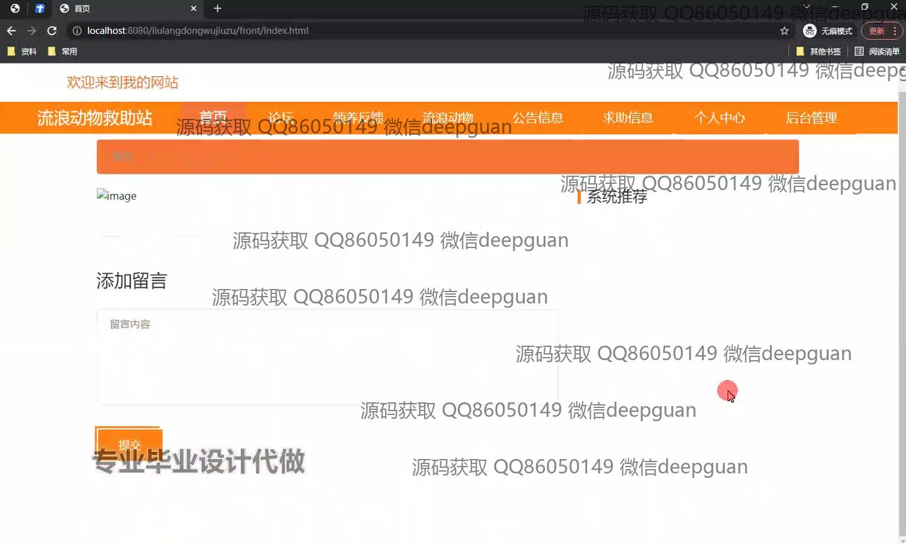

<h1 align="center">流浪动物救助站+vue</h1>

## 简介
流浪动物救助站系统：角色分为管理员、用户；功能包括流浪动物信息管理、领养反馈展示、论坛互动、捐赠信息管理、公告发布及审核、用户和留言管理。    --计算机毕业设计源码；毕设源码；java毕业设计源码

## 联系方式

<h3 align="center">获取完整代码与数据库文件 + 微信：deepguan QQ: 86050149 QQ群: 783742310</h3>

<h3 align="center">可帮忙远程部署 包运行成功！提供远程部署、修改代码、设计文档指导、代码讲解等服务！</h3>

## 功能介绍（完整见运行截图）
管理员：登录、注册、退出后台，管理用户信息、流浪动物信息和机构信息，审核领养申请，处理领养反馈，管理论坛、公告及求助信息，维护捐赠信息和数据统计，支持用户、动物、公告的搜索及新增、修改、删除功能，提供数据展示和互动功能。用户：注册登录后可访问个人中心，查看和更新个人信息，提交并追踪领养申请，与管理员互动，通过论坛参与讨论，浏览流浪动物信息及领养反馈，查看公告和求助信息，参与捐赠活动并查看相关信息，使用搜索功能快速获取所需信息。

## 运行截图

本代码来源于网络,仅供学习参考使用!

